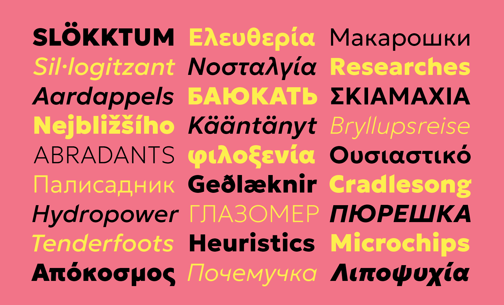

# Geologisk 

Bla bla bla.

## Basic information

Bla bla bla.

### Variable axis

| Axes          | Tag   | Range      | Default  | Description                                            |
| :------------ | :---- | :--------- | :------- | :----------------------------------------------------- | 
| Weight        | wght  | 100 to 900 | 100      | Light to Black                                         |
| Slant         | slnt  | 0 to -12   | 0        | Upright (0°) to right-leaning (12°)                    |
| Italic        | ital  | 0 to 1     | 0        | Swaps roman for cursive variants of certain characters |
| Diagonal cuts | DIAG) | 0 to 100   | 0        | Calligraphic detailing and terminal treatment          |


# Building the fonts

## Step 1: Virtual environment & requirements

### Navigate to the root directory
```
cd [folder location]
```

### Set up a virtual environment in the root directory

```
virtualenv -p python3 venv
```

### Activate the virtual environment

```
source venv/bin/activate
```

### Install requirements

```
pip install -U -r requirements.txt
```

You might also need to install ttfautohint

```
brew install ttfautohint
```


## Step 2: Build the fonts


### Navigate to /sources
Assuming you are already in the root directory

```
cd sources
```

### Build designspace file in /master_ufo
**Note:** The `/helpers` folder includes a file called `axisActivatedFeatures.txt`. If you rebuild the existing designspace after making changes to the sources, merge the contents of this file with your .designspace file. See details in the file.

```
sh build_ds.sh
```

### Build OTvar fonts

```
sh build_vf.sh
```

### Build static TTF fonts

```
sh build_statics.sh
```

### Build OTvar + static TTF fonts

```
sh build.sh
```  

### usWeightClass patch

The usWeightClass for Thins and UltraLight are set to 100 and 200 consecutively. There is a debate on whether these values cause the fonts to get blurred on certain versions of Windows. (https://github.com/googlefonts/fontbakery/issues/2364) 

If you want to change them to 250 and 275 copy the script `sources/fix_usWeightClass.py` to your fonts directory and run it as follows.

```
cd fontfolder # make sure to change to the directory that includes the ttf's or otf's
python fix_usWeightClass.py
```
