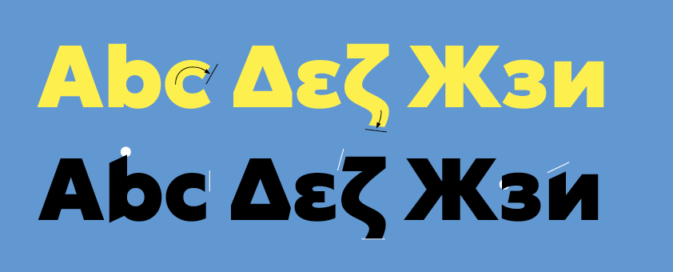

# Geologica 

Geologica is grounded in the humanist genre, but leans assertively into geometric, constructed letterforms to find its stability. The wide stance, generous spacing, large apertures and even colour makes Geologica a serious text typeface. The stylistic “Sharpness” axis adds a rational interpretation of calligraphic pen strokes – a modernist echo of the roots of writing.



The default style of the Geologica typeface is a sober humanist sans serif with a rational finish. The terminals are perpendicular to the direction of the pen stroke, emphasising the monolinearity of the letterforms. The alternate “Sharp” styles introduces details derived from writing with a broad-nib pen. Sharp points arise where the imagined pen is set to paper. These details are echoed in the Carthesian terminal treatment, causing curved shapes to form sharp inner points as they terminate.

Geologica uses the power of the OpenType Variable Font format to simultaneously morph between Light and Black weights, Upright and Oblique, and stylistic variants. This gives an incredibly rich typographic palette, making Geologica a typeface of great versatility. 


### Variable axis

| Axes          | Tag  | Range      | Default  | Description                                            |
| :------------ | :--- | :--------- | :------- | :----------------------------------------------------- |
| Cursive       | CRSV | 0 - 1      | 0        | Swaps Roman for Cursive variants of certain characters | 
| Sharp         | SHRP | 0 to 100   | 0        | Detailing and terminal treatment                       |
| Weight        | wght | 100 to 900 | 100      | Thin to Black                                          |
| Slant         | slnt | 0 to -12   | 0        | Upright (0°) to Oblique (-12°)                         |


# Building the fonts

## Step 1: Virtual environment & requirements

### Navigate to the root directory
```
cd [folder location]
```

### Set up a virtual environment in the root directory

```
virtualenv -p python3 venv
```

### Activate the virtual environment

```
source venv/bin/activate
```

### Install requirements

```
pip install -U -r Requirements.txt
```

You might also need to install ttfautohint

```
brew install ttfautohint
```


## Step 2: Build the fonts


### Navigate to /sources
Assuming you are already in the root directory

```
cd sources
```

<!-- **Note:** The alternate cursive shapes are produced using alternate layers in the source file. If you want to include new glyphs with cursive shapes, please ensure to generate them at position `[0,5<CRSV<1]` in the Cursive axis. -->

### Build designspace file in /master_ufo

```
sh build_ds.sh
```

**Notes:** 

- Run this command every time you make changes to the source file.
- Once you update the designspace, merge the contents of the `RulesFeatureVariations.txt` file with your .designspace file. See details in the txt file.

### Build OTvar and TTF fonts

```
gftools builder config.yaml
```

<!-- ### Build static TTF fonts

```
sh build-statics.sh
``` -->
