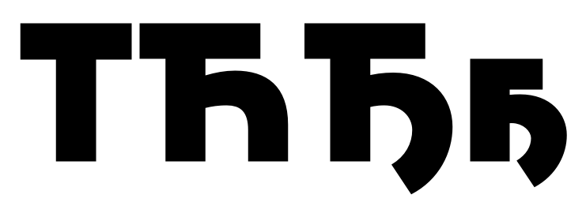

# Cyrillic review

## March 30 2020
*Daria Petrova <petrovada@gmail.com> to Frode*

Hey Frode!

Thanks for sharing the file, it was a new experience for me, actually much more pleasant than checking pdfs.

I learned that working directly with outlines has some traps as well. 
First, it’s difficult not to polish the curves, after making changes, but I successfully restrained myself – they need some polish :) (also anchors)
Secondly, I noticed more details, maybe unnecessarily, so I apologize that almost every letter from the basic CYR alphabet is touched. 

There were only a few really disturbing things – the shape of the б, the length and the construction of the descenders in the дщц etc, and the ъыь group. The rest are just small details, mostly some proportion adjustment. I added a few notes directly in the glyphs file when the changes were not obvious (the comment tool is not perfect there yet, it’s tricky to find). The original curves are in the background for you to compare. I only touched the basic 33(×2) letters in the first two masters, since the others are dependent of these. I hope it’s all clear.

Concerning the Cut styles. I have a feeling that the Cut styles are based on some older version of Cyrillic, aren’t they?
I find this cuts very disturbing since they are hardly visible and rather look like an error:

There are not so many possibilities for these cuts in the fence-like Cyrillic, here are a few I could find:

Concerning the character set: 
I doubt very much that a corporate font might need those letters /yat-cy /yusbig-cy /fita-cy /izhitsa-cy, unless its something linguistic. Those are for very outdated (pre 1917) or even older Russian orthographies. Glyphs sorts /yat-cy /yusbig-cy as Historic Bulgarian, but since you don’t have any modern Bulgarian letters it all has no use. Btw, does the customer need support for Bulgarian language?

/gedescender-cy /yerudieresis-cy /qa-cy /we-cy those four are very obscure. Kurdish (during Soviets) language, Mari language (Hill Mari or Western Mari (Мары йӹлмӹ) is a Uralic language closely related to Northwestern Mari and Meadow Mari) and Yupik (The Yupik (/ˈjuːpɪk/) are a group of indigenous or aboriginal peoples of western, southwestern, and southcentral Alaska and the Russian Far East.)...

There are many more letters that are very unlikely to be used in the current character set, but out of some traditions or rather due to Lucas’ megalomania, we also add them to custom fonts at LucasFonts. I don’t know how crucial is the file size for the customer. Too much is probably better than too few, but the aforementioned are too obscure even for my practice of working with a megalomaniac :)

Please ask questions, or we can have a call if you want, any weekday after 7 or on the weekend.

Best,
Д

## April 4 2020
*Frode Helland <frode@monokrom.no> to Daria* 

Hi Daria,

These are very valuable comments! Thanks a lot. I understand your concerns about the character set. I’m following a defined standard from the client, but you are right about the missing localized characters. I’ll be sure to include them. 

I think there maybe was some misunderstanding about what I am trying to do with the variable font. The extremes should be compatible but also work for intermediates. I don’t want to change the structure of shapes like ж and к. I’m only making changes to the detailing (mostly terminals and x-height cuts). These follow a calligraphic logic, so your proposed ж struck me as a little off with the pronounced mirroring.

Questions:
• Did you have comments on Д Л д л in the “cut” master? 
• How should the descender attach to vertical stems (Ң Ҷ Ӌ Ӷ ң ҷ ӌ)? 
• How should the descender attach to diagonals (Җ Қ Ҳ җ қ ҳ)?
• Should I adjust the length of Ћ Ђ Ҕ ҕ according to Г г? Or are they ok as is?
• Should I adjust the length of Ъ Ҡ Ҥ ъ ҡ ҥ according to Г г? Or are they ok as is?
• I’m assuming Б Ы Љ should follow the proportions of Ь, but should Њ make adjustments to align with the bar?
• If I narrow Ч, do I also have to narrow Ћ Һ? And what about Ђ Ҕ?
• Is it acceptable to cut the middle stem in ж?

[…]

And, about these details:

I understand your hesitation. Maybe they need to be more pronounced, or just take them out? How would these corners normally come out if you used a broad nib pen?

## April 5 2020
*Frode Helland <frode@monokrom.no> to Daria* 

Daria,

I wonder if it would be beneficial if I work through your comments, and do some guessing where I have questions, and then let you look at it again? Then, I can also include localized variants.

## April 6 2020
*Daria Petrova <petrovada@gmail.com> to Frode*

Hey Frode,
sorry for the late reply!
I’ll look at the file again, when all the local alternates and other letters are there.

To your questions:

there is a good article that covers most of your Serbian questions. I always use it as a starting point and in most typefaces there’s no need to invent something new.
https://medium.com/@boomtown.cowboy/design-guides-for-cyrillic-letter-%D1%9A-nje-how-to-design-cyrillic-letters-%D1%9A-nje-%D1%99-lje-%D1%9B-tshe-f9b565a477cc

• Did you have comments on Д Л д л in the “cut” master? 
– I guess they should be exactly same as the ‘normal’ masters, but with ‘cuts’. I didn’t understand why the basis shape was different.
• How should the descender attach to vertical stems (Ң Ҷ Ӌ Ӷ ң ҷ ӌ)?  
– Same as ЦЩДцщд.
• How should the descender attach to diagonals (Җ Қ Ҳ җ қ ҳ)?  
– Same as ЦЩДцщд, but the horizontal part might be shortened.
• Should I adjust the length of Ћ Ђ Ҕ ҕ according to Г г? Or are they ok as is? 
– see the article. These are very strange letters. I really don’t see any logic in them so I tend to trust the Serbian natives.
• Should I adjust the length of Ъ Ҡ Ҥ ъ ҡ ҥ according to Г г? Or are they ok as is? 
– They can be a bit shorter than Гг. I usually make Ъ Ҡ ъ ҡ same as Тт, and Ҥ ҥ same as Гг or a bit shorter if the whole letter looks too wide.
• I’m assuming Б Ы Љ should follow the proportions of Ь, but should Њ make adjustments to align with the bar? 
– See the article, I think it’s better when they are aligned.
• If I narrow Ч, do I also have to narrow Ћ Һ? And what about Ђ Ҕ? 
– Yes, they are all dependent
• Is it acceptable to cut the middle stem in ж? 
– Yes, maybe some diagonals as well? (just a suggestion, I understand that it might be too frivolous for the system you have)  

Concerning the cuts on the straights in п н etc., – if you don’t mind loosing weight they might become more pronounced:

Or you can just get rid of them, since you don’t chip off the B. 

Looking forward to see an update!
Good luck,
Д.

## April 8 2020 
*Frode Helland <frode@monokrom.no> to Daria* 

Thanks. Revisions enclosed. The challenge with Л is that a comfortable vertical termination of the left side requires some reworking of the curve.

/f

[…]

Hi Daria. Please look at this instead. Forgot about Ҥ ҥ (following Г г width) and repurposed the right hand side of Њ for Ѣ to avoid clogging.

[…]

I was not quite satisfied with the hard top left corners in the lowercase Cyrillic, and tried instead this solution – echoing the angle from lowercase ‘n’. Here’s a screenshot from Axis Praxis. 

[…]

… and the file.

## April 9 2020
*Daria Petrova <petrovada@gmail.com> to Frode*

Hey Frode,

I looked at the files and have almost nothing to complain about, it’s good! I’ll send you a couple minor remarks tomorrow.
Best, 
Д.

## April 10 2020
*Daria Petrova <petrovada@gmail.com> to Frode*

Hi Frode,

I’m not a big fan of these (п в г д etc) cuts in general, but it’s the best solution so far.

Here are a few remarks:

1. I think the horizontal strokes in CYR lack consistency in weight ant how far they extend (in both weights). 
 Yat-cy can be a little taller than other upper case letters.  

2. I would make the triangle of the Bulgarian Д same as A or even narrower in both weights.

3. The ascending stroke of the м seems a bit too heavy.

4. I would make the left part of ЋЂ same as T, in both weights. Maybe lower the middle stroke of the ghemiddlehook-cy to redistribute white space?

5. I thin Лл in the 5&6th masters lack some weight at the bottom. I would align them to the horizontal of Дд. And maybe make the curvature more energetic like in the f t?

6. Not dramatic, but I think in light ge-cy.loclBGR there is something wrong with the curvature of the middle part, it also can be a bit thinner than the middle stroke of the s. In the black I would make both verticals same as those of o (after the broad nib pen logic) Not sure why did you make it a bit wider, just curious. 

That’s it! I’ll send you a separate note on the local Cyrilics, it’s only questioning existence of some of them.

Best, 
Д

## April 14 2020
*Daria Petrova <petrovada@gmail.com> to Frode*

Hey Frode,

for some mysterious reasons this wasn’t sent!

I wanted to ask what were your sources for making these local alternates except for localfonts.eu?

Lje-cy.loclBGR is not needed; it’s rarely used for a bunch of Balkan languages and those have a default Л shape.
ef-cy.locl is fun but I don’t know what is it for? 
ghestroke-cy.loclBSH zedescender-cy.loclBSH esdescender-cy.loclBSH here I was seriously puzzled. I asked a few Russian colleagues – they never made a local feature for bashkir language and have never seen it; I took a trip through their capital with Google maps – max. 10% of all texts was duplicated in Bashkir language next to Russian. But since they’re already there – why not :)
gje-cy.loclMKD pe-cy.loclSRB te-cy.loclSRB just wanted to make sure that you are aware that these are only needed in italic.

That’s it! 
Good luck!

Д.

## April 15 2020
*Frode Helland <frode@monokrom.no> to Daria*

Thanks Daria,

I’m sorry about the apparent chaos in my character set. This is opposite to how I normally work, and very frustrating to me too.  It is my understanding some of the localized characters should differ in sans/serif (something localfonts.eu doesn’t get into much). Another thing is that these are poorly supported in many environments, and I have doubts about locl as a solution in the first place. 

Anyway, I pulled info from localfonts.eu, Google Fonts, Fontsmith and some Typedrawers/Typophile discussions.

Quick question: Ѣ and ѣ are often drawn with a T-like bar with vertical serifs. Would it make sense to preserve that logic in a sans serif, or is it better to match the horizontal bars?

All your comments have been very helpful and on point. 

/f

## May 4 2020
*Daria Petrova <petrovada@gmail.com> to Frode*

Hi Frode!

To the archaic letters Ѣ and ѣ, you are right that those guys are usually treated as Tт. But in the case of this font it’s okay to just handle them as normal horizontal bar. I mean, in black ѣ you just have to somehow squeeze 4 horizontal stems into a given space, and there’s not much you can do.

Best,
Д
