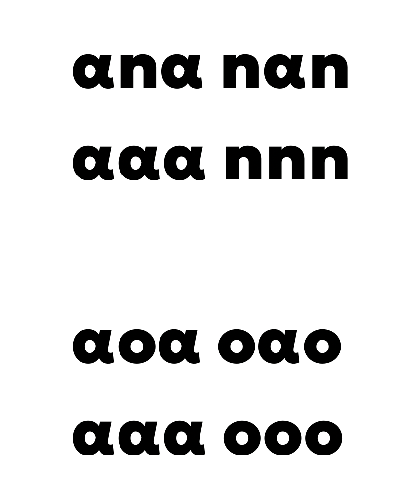
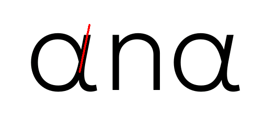
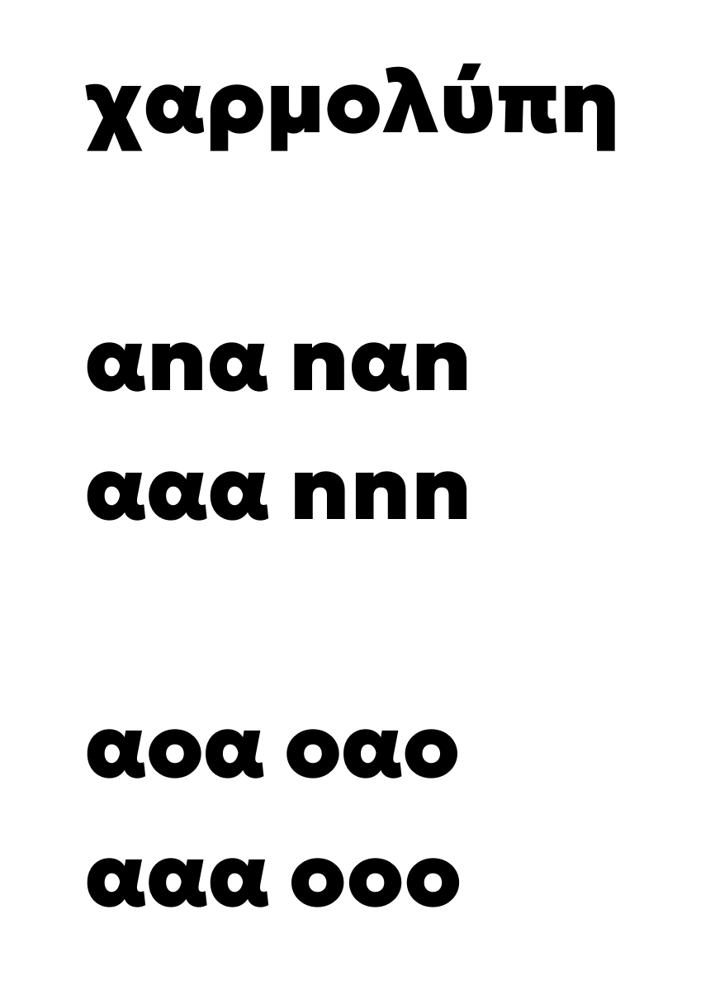
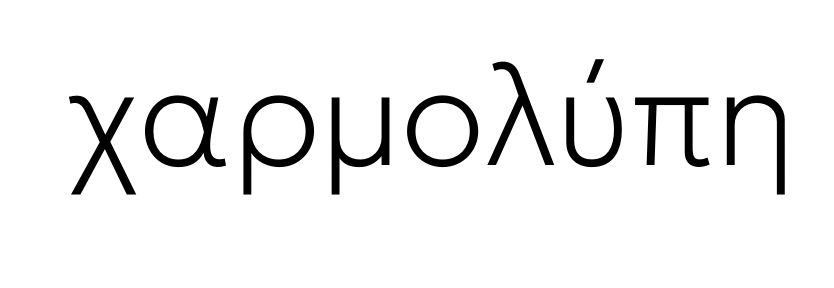
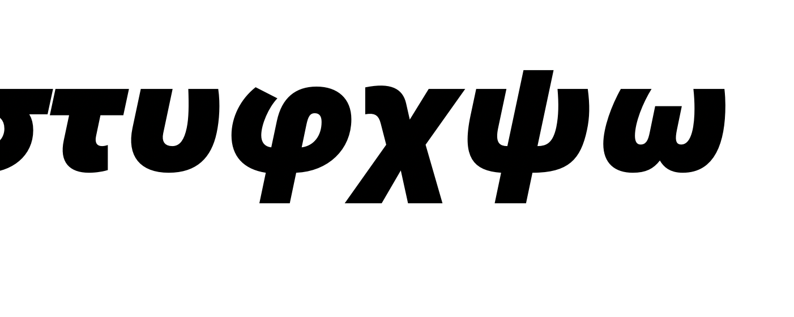
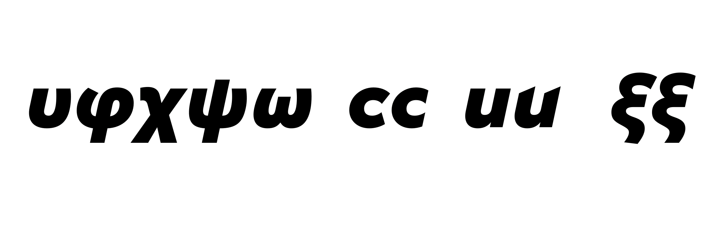
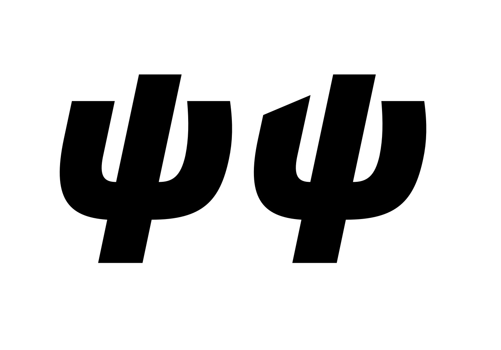
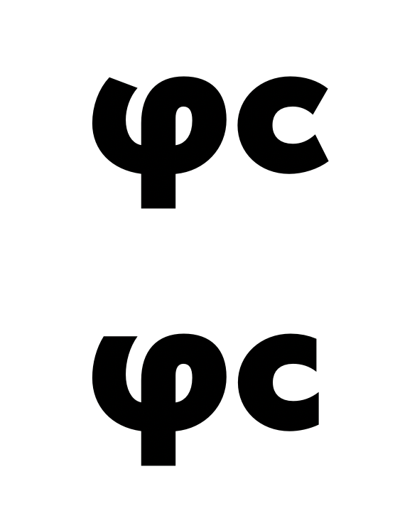
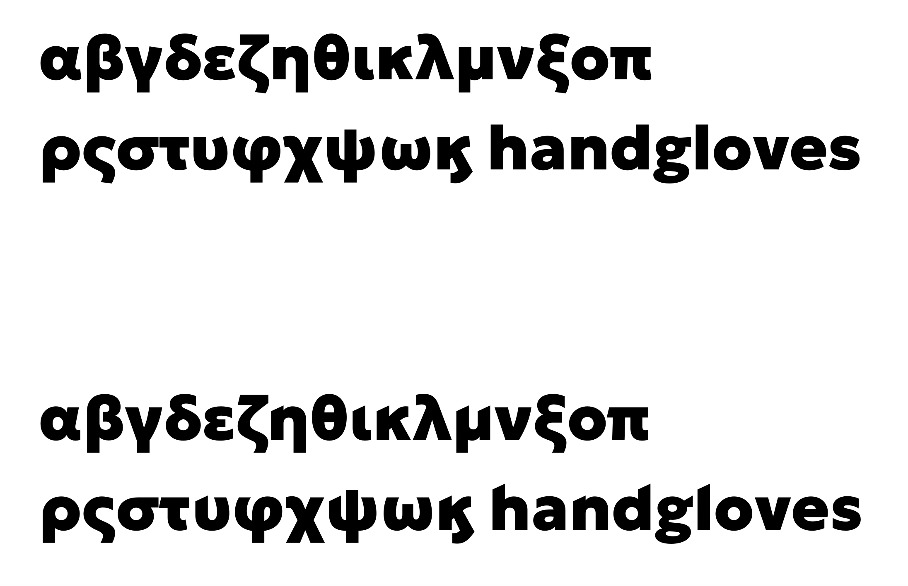
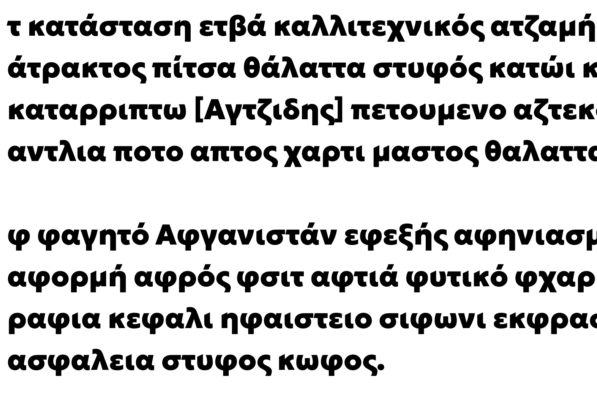

# Email review

## February 6 2020
*Frode Helland <frode@monokrom> to Kostas*

<Glyphs file enclosed>

## February 10 2020
*Kostas Bartsokas <kosbarts@yahoo.com> to Frode*

Hi Frode,

I am sending you via Wetransfer the following: 
- a pdf with annotations of Light and Black masters
- a pdf test print of Light master
- a pdf test print of Black master
- a pdf test print with various typesetting scenarios of the Regular weight.

I am going to opensource the InDesign files that generate these testing pdfs but they are still not 100 done. But I am sharing them with you in the zip so you can use them for proofing the greek. 

Overall I have to say that the design is good and it works well as a sidekick to the latin. I can spot some weight issues in the Black master that could be improved and also some details that I think might create a more cohesive character set in the sense that some ideas feel unnecessary mixed together. 

Here is a list with comments on each glyph. For obvious reasons I have not made any comments on glyphs that are identical between the two scripts:
- Psi. 
Light; It has a rather narrow character which is not bad but I think there is room to lower the bowl and increase the light in the counter.
Black; Compared to the overall proportions of other letters it tends to look rather wide in contrast with the Light weight. I think you can make it narrower and add some roundness to the bottom outside arcs.

- Omega. 
I think in both cases the structure seems too archaic, with the rather long straights. This is more pronounced in the Black. I would consider the following:
Light; make the straight segments narrower.
Black; make the straight segments narrower. Consider making the counter more open, the overall shape rounder and closer to the Light, and release some of the tension from the top that makes it look too archaic.

- alpha.
I think that this fish shape is too geometric and rigid for the likes of the character of the rest of the letters. It has been used in some version of Olympia which was the Greek Futura and in that case it works but it goes along with most cursive elements being completely absent (some funny exceptions thought with a gamma with a bowl and a theta). I forgot to take a picture from my specimens but I will send it later to see what I mean.
I would suggest to move to a more softer shape (see image in pdf). If you do chance the shape you might consider doing it a bit narrower. It will have to have different fitting as well. 

- beta.
Light; You can make the RSB = o
Black; Looks good. Perhaps you can just move the bar some points to the left so that the gap does not look too wide. RSB=o

- gamma, nu.
The super curved upstroke is not bad however it is not communicating great with the rest of the design and it tends to fit weird. I would suggest to move the top nodes a bit to the right and reduce the curvature of the upstroke. Some minor adjustments (like moving the bottom apex ever slightly to the right and widening them just a bit) might help. 

- delta.
Light; It is good as is but I think it would improve if you move the top left part to the left and lengthen the outstroke (it also thins slightly but I think it would be better if it follows what is happening in the a). The diagonal needs some more weight.
Black; I think you have reduced the weight of the round stems too much and it looks too light compared to other letters. You can re-install the missing weight and then do the same as in the Light, widen the top left a bit and the outstroke a bit. 

- epsilon.
This is the trickiest of all, especially in the heavier weight. 
Light; You can rounden the arcs and also make the bottom outstroke slightly wider and more like the c.
Black; It looks quite light. I would suggest to add a bit more weight in the horizontal part of the bowls by moving all the inner nodes to the right. You can improve the curvature in the top and bottom arcs and also raise slightly the top instroke and lengthen the outstroke in the bottom. That would give it the extra weight and also correct the balance. The RSB is quite wide. 

- zeta.
Black; It looks totally different compared to the light and a bit unbalanced. Try moving the whole top part to the right. The weight of the diagonal on the baseline can be slightly heavier.

- theta.
Black; It might need some more curviness in the outer curve on both top and bottom. 

- iota.
Black; I think the fitting is completely off. Too narrow on the LSB. 

- kappa.
Black; It is quite tricky to follow what is happening to he Light weight. I think some changes are required so that it performs the same. The cut on the upwards outstroke can be tilted inwards. Some room for weight improvement in the downstroke as well, perhaps bring it closer to the weight of the Latin k.

- lambda.
Light; The NE diagonal is a bit heavy and the SW too thin. You could also move the nodes of the SW just a bit to the left to give it a better balance.
Black; I think it looks to dense in the top. Consider removing weight from the top instroke, and also to add some weight in the inner part of the SW stroke, close to the joint.

- ksu.
Black; I think it looks too light. You can add some weight in the top part both vertically and horizontally and also some in the bar and the diagonal stroke on the baseline. Small refinements.

- pi.
Light; You can make the outstroke slightly longer so that it sits better. Also consider just tilting the left leg slightly. RSB is too narrow.
Black; Same as the Light, you can just tilt the left leg slightly. Potentially it might benefit by a decrease in the weight of the right leg. RSB is too narrow.

- rho.
Black; The LSB is too wide.

- sigmafinal.
Black; Just as small fix in the curvature in the inner curve where the downward stroke starts. 

- tau.
Light. Consider moving the leg 10 pt to the right. Add some more space on the LSB.
Black. Remove some space on the RSB.

- upsilon.
Black. I think that you can remove some weight from the bottom of the bowl. I would suggest to copy the LSB of the iota and make the RSB smaller as well. 

- phi
Both masters tend to bulge in SW and NE. The Black looks more flat than round (it bulges in SE as well). 
Black; you can make it rounder in the bottom and make the horizontal cross a bit thinner. The instroke could also benefit with some additional weight.

- chi.
Light; This is a tiny detail but if you could move the top part of the crossing point of the downward stroke ever so slightly to the left it would look better. Add some space on the LSB.
Black; Overall looks quite heavy. I would consider making the instroke thinner and try to fix the overall weight. RSB is quite wide.

- psi.
Black; It is quite wide. Perhaps make it narrower. The horizontal cross could lose some weight and the descended could gain some. Fix the SB according to upsilon.

- anoteleia.
It should be top aligned to the x-height. 

As I said, I had to play around with the file in order to see what works best. The changes I have made are not refined to the best point that they could be. All glyphs that are marked Red have some change in one or both masters. I hope they give you some guide of what I mean with the comments. 

That's all for now. I am looking forward to see the version with the cuts.

Best,
K.

## February 10 2020
*Sindre Bremnes <sindre@monokrom.no> to Kostas, Frode*

Hi,

Thank you so much for this, Kostas! Your insights and comments are absolutely invaluable; I rest assured we will get this right now, thanks to your input. It is a weird thing, designing foreign alphabets – it probably can’t be done right without the help of a native speaker.  

S.   

## February 10 2020
*Frode Helland <kosbarts@yahoo.com> to Sindre, Frode*

Hi Sindre,

I am glad you find it useful. Yes, I think that it is really hard to design a script you are not a user of, and it takes time and lots of practice in order to get used to it. Thankfully Greek and Cyrillic are very close to Latin, and I believe that you can arrive to a certain level of experience relatively fast.

I am here if you need anything else. 

Best,
K.

# Chatlog

## Kostas Bartsokas
*12. mar. 2020, 13:30*
so I was looking at the new Geologisk greek

*12. mar. 2020, 13:31*
in the version you sent me, without the italics, the black weight had spacing issues

*12. mar. 2020, 13:32*
shapes are good now

*12. mar. 2020, 13:33*
the lc alpha is way too loose on the right side

*12. mar. 2020, 13:33*
it creates large gaps with most of the other letters

## Frode Konstantin Helland
*12. mar. 2020, 13:45*
You wanna see the glyphs file? Easier to make notes there.

## Kostas Bartsokas
*12. mar. 2020, 13:45*
it's just the fitting of alpha in the heavier weight

*12. mar. 2020, 13:46*
that definitely needs adressing

*12. mar. 2020, 13:46*
and the stroke of the alpha in the light weight that looks a bit heavy on the right side (upstroke mostly)

## Frode Konstantin Helland
*12. mar. 2020, 13:47*

## Kostas Bartsokas
*12. mar. 2020, 13:48*
yes

## Frode Konstantin Helland
*12. mar. 2020, 13:49*
This one?

*12. mar. 2020, 13:49*

## Kostas Bartsokas
*12. mar. 2020, 13:50*
yes

## Frode Konstantin Helland
*12. mar. 2020, 13:52*
I think this spacing is a little choppy still …

*12. mar. 2020, 13:52*

*12. mar. 2020, 13:52*
Frode Konstantin Helland
maybe just the kerns agains chi and lambda

## Kostas Bartsokas
*12. mar. 2020, 13:54*
yes that's better

*12. mar. 2020, 13:54*
and you will have to add these kerning pairs

*12. mar. 2020, 13:54*
I think greek is a little bit more wobbly and tricky to fit across all letters, if you want it to work with as few possible kerning pairs

*12. mar. 2020, 13:55*
lots of irregularities

## Frode Konstantin Helland
*12. mar. 2020, 13:55*
upstroke minus 5 units

*12. mar. 2020, 13:55*

## Kostas Bartsokas
*12. mar. 2020, 13:56*
yeah

*12. mar. 2020, 13:56*
better

## Frode Konstantin Helland
*12. mar. 2020, 14:17*
good

## Frode Konstantin Helland
*12. mar. 2020, 14:17*
this is also no kerning

## Frode Konstantin Helland
*12. mar. 2020, 14:17*
so maybe the fitting of diagonals in black weights needs another look

## Kostas Bartsokas
*12. mar. 2020, 14:18*
could be, yes

## Frode Konstantin Helland
*29. mai 2020, 17:42*
Hey …

## Kostas Bartsokas
*29. mai 2020, 17:42*
hey mate

## Frode Konstantin Helland
*29. mai 2020, 17:42*
Left side of phi

## Kostas Bartsokas
*29. mai 2020, 17:42*
yes

## Frode Konstantin Helland
*29. mai 2020, 17:42*

*29. mai 2020, 17:42*
should it relate to any of the others here?

## Kostas Bartsokas
*29. mai 2020, 17:43*
yes. the cut should follow the omega

## Frode Konstantin Helland
*29. mai 2020, 17:43*
Wonder if I should slice the other “vertical” terminals similarly

## Kostas Bartsokas
*29. mai 2020, 17:43*
or vice versa

## Frode Konstantin Helland
*29. mai 2020, 17:43*
… yes

## Kostas Bartsokas
*29. mai 2020, 17:43*
look at your latin too

## Frode Konstantin Helland
*29. mai 2020, 17:43*
that is the question

## Kostas Bartsokas
*29. mai 2020, 17:44*
given the rest of the set I think the cut should be flat and on the meanline

## Frode Konstantin Helland
*29. mai 2020, 17:44*
but in the latin, the comparable details are kinda more the terminals of c

*29. mai 2020, 17:44*
different direction

## Kostas Bartsokas
*29. mai 2020, 17:45*
but then the right terminals of upsilon and psi should also follow the same principal

## Frode Konstantin Helland
*29. mai 2020, 17:45*
yes!

## Kostas Bartsokas
*29. mai 2020, 17:45*
and the omega

## Frode Konstantin Helland
*29. mai 2020, 17:45*
I think maybe they should :)

## Kostas Bartsokas
*29. mai 2020, 17:45*
haha

*29. mai 2020, 17:46*
show me the c and u

*29. mai 2020, 17:47*
hmm but if you choose to cut terminals at an angle to the stroke like you have done in phi, then it should also apply to the chi as well and others too

## Frode Konstantin Helland
*29. mai 2020, 17:47*
“diagonal cut” masters on the rihgt

*29. mai 2020, 17:47*

## Kostas Bartsokas
*29. mai 2020, 17:48*
OK. I see where you are coming from

*29. mai 2020, 17:48*
it might make an intersting interpretation of the c to have a curved terminal and a flat for the phi, etc

## Frode Konstantin Helland
*29. mai 2020, 17:49*
psi straight/cut

*29. mai 2020, 17:49*

## Kostas Bartsokas
*29. mai 2020, 17:50*
hmmm. the diagonal cut is not implicit of any relationship to a change of the angle of the tool...

*29. mai 2020, 17:50*
it feels like it is more of a showstopper so I guess you can interpret it more freely in the greek

*29. mai 2020, 17:51*
the psi you just showed me work well

*29. mai 2020, 17:51*
but I guess it might work equally well with the left terminal at an angle to the stroke

*29. mai 2020, 17:52*
however, you still would want to preserve that "sharpness". And in the case of the phi you showed me first, I think you are loosing the sharpness and it becomes a very humanistic detail

## Frode Konstantin Helland
*29. mai 2020, 17:54*
so, the logic is that in the regular master, all strokes terminate perpendicular to the stroke direction

*29. mai 2020, 17:55*
in the diagonal master, I introduce sharp details

*29. mai 2020, 17:55*
x-height of straight stems (n, u) triangular cut, terminals of curved strokes (c, s) sliced vertically, so the inside forms a sharp point

## Kostas Bartsokas
*29. mai 2020, 17:59*
so in that phi you showed me first you are kind of missing that sharp point

*29. mai 2020, 17:59*
what if it was facing the other direction? the point being on the top left and a cut towards the baseline

*29. mai 2020, 18:00*
(I hope that makes sense)

## Frode Konstantin Helland
*29. mai 2020, 18:00*
I’ll try to do it the way it makes sense to me :) and show you after!

## Kostas Bartsokas
*29. mai 2020, 18:00*
OK. Show me when you do it

## Frode Konstantin Helland
*29. mai 2020, 18:07*
logical connection here, at least to me :)

*29. mai 2020, 18:07*

## Kostas Bartsokas
*29. mai 2020, 18:11*
isolated in these two it makes sense

## Frode Konstantin Helland
*30. mai 2020, 13:40*

## Kostas Bartsokas
*30. mai 2020, 13:42*
it works

*30. mai 2020, 13:42*
how about the descenders?

*30. mai 2020, 13:42*
do you have a cut in the p? should there be one in the rho and mu?

## Frode Konstantin Helland
*30. mai 2020, 13:48*
the straight descender are not sliced

*30. mai 2020, 13:49*
only the tops of ascenders and along the x-height

## Kostas Bartsokas
*30. mai 2020, 13:49*
ok. then the top and bottom combinations check

## Frode Konstantin Helland
*10. jun. 2020, 15:27*
redrew my zeta, xi and final sigma

*10. jun. 2020, 15:27*
those are HARD!

*10. jun. 2020, 15:29*
that chi corner is also a real challenge!

*10. jun. 2020, 15:29*
soo tight in heavy styles

*10. jun. 2020, 15:33*
anyway, the rhythm is more solid now

*10. jun. 2020, 15:33*

## Kostas Bartsokas
*10. jun. 2020, 15:41*
Yes the chi is a pain when it has the curve

*10. jun. 2020, 15:41*
But I think you look good
