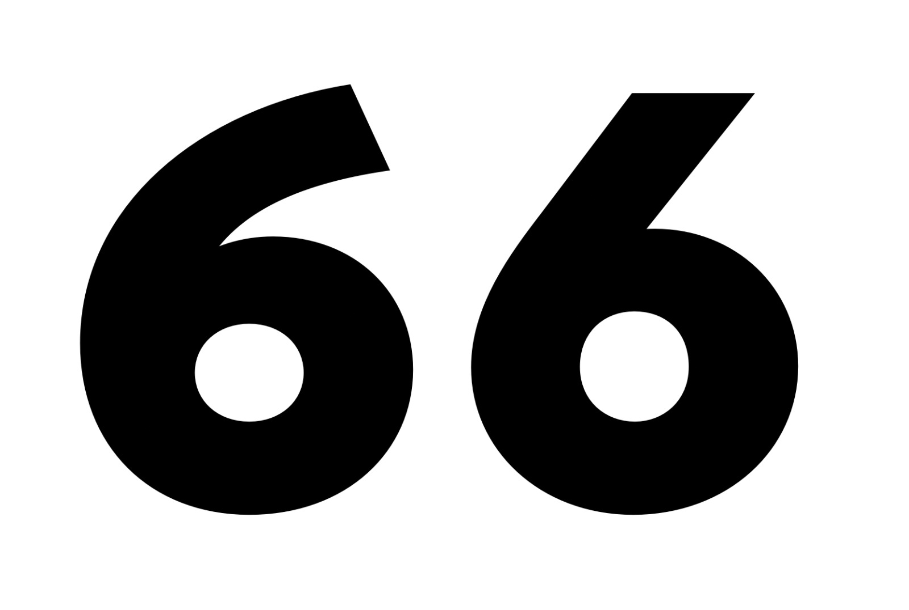
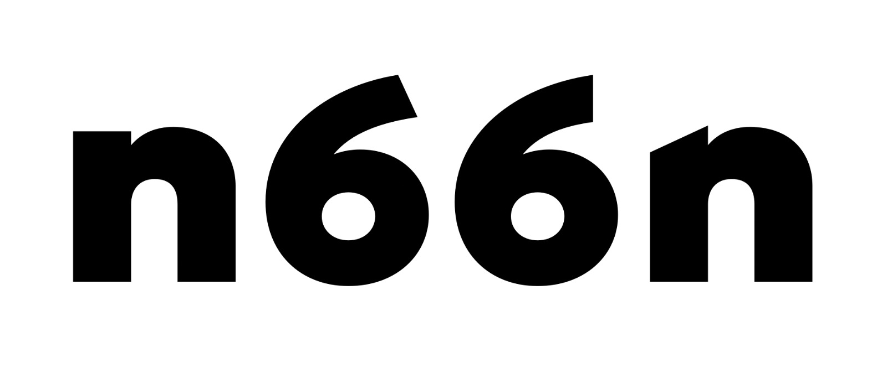
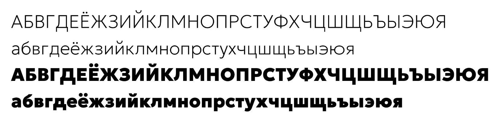
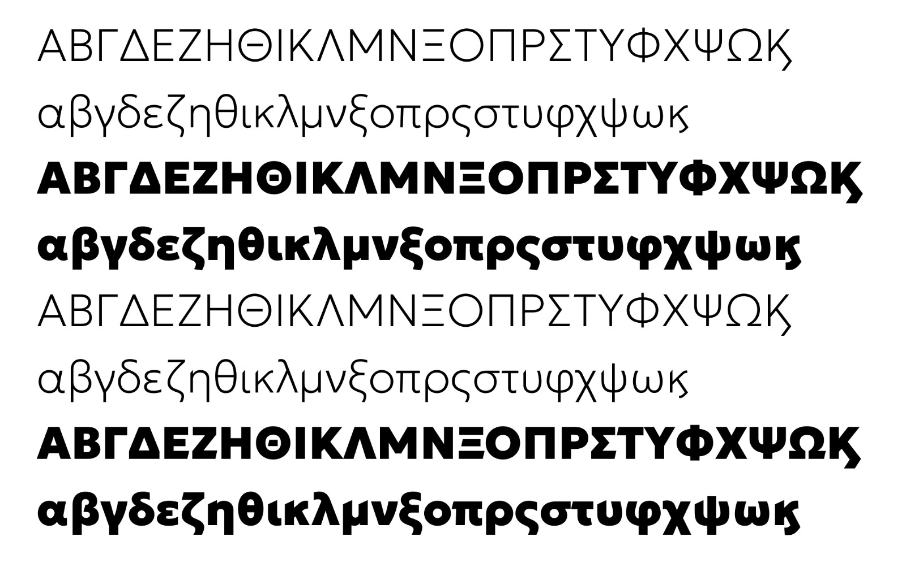

# GF internal design conversation

[13:02, 27.1.2020] Frode: Will you please have a look at this [2020-01-27 GeologiskGX-27jan.ttf.zip], Dave?
[13:05, 27.1.2020] Frode: A little rough so far, but I’ve explored the two extremes of the stylistic axis more fully: The normal style embraces perpendicular terminals, while the “display” style make sharp angles with the diagonal cut stems and 90 degree angled terminals. The latter forms have the added benefit of pulling things closer together (the display c, for example, can sit much closer)
[13:06, 27.1.2020] * to neighbouring characters
[13:06, 27.1.2020] Frode: * to neighbouring characters
[14:06, 27.1.2020] +1 (917) 547-7942: Awesome

[14:06, 27.1.2020] Frode: I can’t see a good clean interpolation between these two.
[14:07, 27.1.2020] Frode: So, that might have to be a glyph swap at some point in the axis
[14:07, 27.1.2020] +1 (917) 547-7942: Sounds great
[14:07, 27.1.2020] Frode: Or, optionally:
[14:07, 27.1.2020] +1 (917) 547-7942: Would need HOI
[14:07, 27.1.2020] Frode: sorry, wrong inmage

[14:08, 27.1.2020] Frode: Yes, high order interpolation.
[14:08, 27.1.2020] +1 (917) 547-7942: Looks goofy
[14:08, 27.1.2020] +1 (917) 547-7942: 2nd 6 there
[14:08, 27.1.2020] +1 (917) 547-7942: Rvrn swap is fine
[14:09, 27.1.2020] Frode: I’m not sure how to set that up … neither HOI nor a glyph swap along the axis
[14:10, 27.1.2020] +1 (917) 547-7942: HOI is today a lot of work because tools aren't available
[14:10, 27.1.2020] +1 (917) 547-7942: In future I expect it to be simple
[14:10, 27.1.2020] +1 (917) 547-7942: But for now, forget about it
[14:10, 27.1.2020] +1 (917) 547-7942: Glyph swap should be easy
[14:10, 27.1.2020] +1 (917) 547-7942: You could ask on the Glyphsapp forum
[14:11, 27.1.2020] +1 (917) 547-7942: Or look at recursive and Hepta slab
[14:13, 27.1.2020] Frode: They don’t offer the glyphs sources, afaik
[14:13, 27.1.2020] Frode: just UFO
[14:14, 27.1.2020] Frode: I’ll just keep two separate glyphs for now
[14:14, 27.1.2020] +1 (917) 547-7942: Hepta was Glyphsapp
[14:15, 27.1.2020] +1 (917) 547-7942: It's also possible to set up the rvrn with a fonttools script if you can't get it set up in a .Glyphs file and built with fontmake
[14:15, 27.1.2020] +1 (917) 547-7942: Just van Rossum wrote the fonttools code
[14:17, 27.1.2020] Frode: yep. Thanks
[14:17, 27.1.2020] Frode: So, just to recap:
[14:18, 27.1.2020] Frode: We are on the same page re. the changes to the design? If so, I’ll proceed to make a more finalized proposal for the Latin in this direction.
[14:48, 27.1.2020] +1 (917) 547-7942: Can you send me a proof or presentation so I can understand the changes and have a record of the project development
[14:49, 27.1.2020] +1 (917) 547-7942: I don't have time to make my own
[14:49, 27.1.2020] +1 (917) 547-7942: But it's helpful to have the TTF as well
[14:50, 27.1.2020] +1 (917) 547-7942: Ideally I'd expect you to be working on GitHub at this point so I can get the files there, as they happen :) when do you see that happening? :)
[15:03, 27.1.2020] Frode: I can make a specimen
[15:04, 27.1.2020] Frode: I was thinking github a little later down the line, if that’s ok with you?
[15:05, 27.1.2020] Frode: not worried about someone distrusting the origin of our design, and I would like the history of the progress to start with something quite close to the final thing
[15:07, 27.1.2020] +1 (917) 547-7942: Sadly is not ok
[15:09, 27.1.2020] Frode: OK, then I’ll look into github
[15:09, 27.1.2020] +1 (917) 547-7942: I really appreciate it
[15:09, 27.1.2020] +1 (917) 547-7942: Can be a private repo
[21:39, 27.1.2020] Frode: Ok Dave. You have an invite to the github repo
[22:09, 27.1.2020] +1 (917) 547-7942: Got it
[22:09, 27.1.2020] +1 (917) 547-7942: I need to have received the files for formal purposes
[22:09, 27.1.2020] +1 (917) 547-7942: Jason has the docs for how we/GF want the repo set up
[10:13, 28.1.2020] Frode: I am not clear on the requirements listed in the repo documentation
[10:19, 28.1.2020] Frode: Since what I have now is not finished, I cannot ensure that no glyphs/styles are missing in future versions. Everything could potentially change, right.
[17:29, 28.1.2020] +1 (917) 547-7942: Whcjh repo doc exactly?
[17:29, 28.1.2020] +1 (917) 547-7942: Yeah private repo and things swirling around is fine
[17:29, 28.1.2020] +1 (917) 547-7942: I just need to have my hands on something in case I'm audited
[17:29, 28.1.2020] +1 (917) 547-7942: I can't give money without receiving anything
[17:30, 28.1.2020] Frode: Ok

[17:31, 28.1.2020] +1 (917) 547-7942: 👍👍👍👍
[17:31, 28.1.2020] +1 (917) 547-7942: Who will do the native reader design review?
[17:31, 28.1.2020] Frode: Will upload something cyrillic soon
[17:32, 28.1.2020] Frode: I have some ideas for that. Btw: if that’s a requirement, it would be helpful to have up front
[18:06, 28.1.2020] +1 (917) 547-7942: It seems unwise to make your soon to be most used publication not have native reader review; if there's bad reception to your work, it makes it harder for me to get your more and better deals in future
[18:07, 28.1.2020] +1 (917) 547-7942: Do you usually not do native reader review for your retail releases?
[18:44, 28.1.2020] Frode: Yes, I would strongly recommend:)
[18:45, 28.1.2020] Frode: And I would like a list: this is what designer delivers (or pay for) – this is what Google offers.
[18:47, 28.1.2020] +1 (917) 547-7942: I'm not sure what you mean
[19:02, 28.1.2020] Frode: A specified list of what is included in the delivery
[19:03, 28.1.2020] +1 (917) 547-7942: Maybe you could draft the list you wish you had, put in place holders for items/data you don't have, and I can collaborate with you on it
[19:03, 28.1.2020] +1 (917) 547-7942: And jaosn too
[14:09, 30.1.2020] Frode: Committed a draft for the Cyrillics. Gotta head out now, but I’ll upload a new pdf with examples later.
[14:33, 30.1.2020] +1 (917) 547-7942: Awesome thanks!!
[13:41, 31.1.2020] Frode: PDF updated
[14:14, 6.2.2020] Frode: Greeks on the drawing board.

[15:33, 6.2.2020] +1 (917) 547-7942: Oh wow
[15:33, 6.2.2020] +1 (917) 547-7942: Looks legit to me
[17:30, 6.2.2020] +1 (917) 547-7942: I just got back to office yesterday so I'll probably get to the PDFs in the repo tomorrow
[17:30, 6.2.2020] +1 (917) 547-7942: Thanks for your patience
[20:59, 12.2.2020] +1 (917) 547-7942: Hey
[21:00, 12.2.2020] +1 (917) 547-7942: Quick feedback at a high level
[21:00, 12.2.2020] +1 (917) 547-7942: Please try to make sure this is distinguished from Poppins and Google Sans
[12:59, 14.2.2020] +1 (917) 547-7942: I shared a print of the PDF with a colleague in the visual design job ladder
[13:00, 14.2.2020] +1 (917) 547-7942: And they advised to be careful about that
[13:42, 14.2.2020] Frode: Yes, I figured it was something like that.
[13:43, 14.2.2020] Frode: Well, as I said, if you have anything specific you would like to see changed I’d be happy to discuss.
[13:45, 14.2.2020] +1 (917) 547-7942: In your presentation it will be good to point out the differences to reassure the execs we thought about it
[13:46, 14.2.2020] +1 (917) 547-7942: I wonder about maybe addressing adding YTAS, YTDS axes and adjusting their default, as a quick way to address that
[13:47, 14.2.2020] +1 (917) 547-7942: Having the double story a DVD g as default will help
[13:47, 14.2.2020] +1 (917) 547-7942: A and G lowercase
[13:56, 14.2.2020] Frode: I’m not adding another axis, but if you like we can make a few options for ascender/descender height.
[13:56, 14.2.2020] Frode: and you can pick the one you think work best.
[13:56, 14.2.2020] Frode: doublestory a/g is already default
[13:57, 14.2.2020] +1 (917) 547-7942: I think you misspelled "I'd be happy to do that for an additional fee" 😂
[13:58, 14.2.2020] Frode: haha
[13:59, 14.2.2020] Frode: I’m trying to watch scope creep, and we agreed upon the deliverables & are about to set a schedule for delivery
[14:00, 14.2.2020] Frode: major changes like adding another axis will change the feed and schedule, yes
[14:00, 14.2.2020] +1 (917) 547-7942: Are you familiar with those axes?
[14:00, 14.2.2020] Frode: Yes, I think: depth of asc/dsc, right=
[14:00, 14.2.2020] Frode: ?
[14:00, 14.2.2020] +1 (917) 547-7942: Yes
[14:01, 14.2.2020] Frode: In itself it might not be a big thing, but it quickly multiplies across three scripts and proofing additional masters
[14:01, 14.2.2020] +1 (917) 547-7942: Understood
[14:01, 14.2.2020] +1 (917) 547-7942: I'm not committed to doing it
[14:02, 14.2.2020] Frode: so, let’s try and find a extender length that suits you
[14:02, 14.2.2020] +1 (917) 547-7942: The problem is, we need to defend that this is different enough from GS to let my execs  sleep soundly that no other exec is going to come at them for making a libre company brand type
[14:02, 14.2.2020] +1 (917) 547-7942: There are a few ways to do it
[14:03, 14.2.2020] +1 (917) 547-7942: Let's brainstorm ideas and pick the ones with the least effort and highest impact
[14:03, 14.2.2020] +1 (917) 547-7942: Asc/desc seems to me an medium one
[14:04, 14.2.2020] +1 (917) 547-7942: Picking the default storie is very easy
[14:04, 14.2.2020] +1 (917) 547-7942: Numeral forms is medium
[14:04, 14.2.2020] Frode: Yeah, I would just need to understand what it is the exec thinks is too close to Google Sans and Poppins
[14:04, 14.2.2020] +1 (917) 547-7942: Tittles
[14:04, 14.2.2020] +1 (917) 547-7942: They won't have a standard, they have a meta standard, that we thought about it in advance
[14:09, 14.2.2020] Frode: changing the tittles is relatively easy, yes
[14:10, 14.2.2020] Frode: The default numeral form is proportional lining
[14:10, 14.2.2020] Frode: with a secondary set of tabular lining figures
[14:14, 14.2.2020] +1 (917) 547-7942: I meant the letttefirms
[14:15, 14.2.2020] Frode: adding a tail to the "a" perhaps
[14:16, 14.2.2020] Frode: junction of K/k, treatment of the leg of R
[14:16, 14.2.2020] Frode: of course, as you already mentioned, changing the extenders
[14:17, 14.2.2020] +1 (917) 547-7942: Arm of 1 too
[14:17, 14.2.2020] +1 (917) 547-7942: Top
[14:17, 14.2.2020] +1 (917) 547-7942: If it has foot serifs
[14:17, 14.2.2020] +1 (917) 547-7942: Straight vs arched strokes, stuff like that
[14:17, 14.2.2020] +1 (917) 547-7942: Without looking myself, I can't say How similar or different they are
[14:17, 14.2.2020] +1 (917) 547-7942: That's what you need to do is take a look and make sure that they are dependably different
[14:17, 14.2.2020] +1 (917) 547-7942: And then similarly for the axis with the cuts we want to take a look at YouTube signs I think the family name is both YouTube space Sans and YT space sans
[14:17, 14.2.2020] +1 (917) 547-7942: And same thing really Just take a look and see that there are defendable differences
[14:18, 14.2.2020] Frode: Yep. I’ll take a look and note the differences so you’ll have a list. If you still would like to change something after that we could def. look into some of the options we just discussed now
[14:19, 14.2.2020] Frode: I think if you are trying to convince someone who think all monolinears look the same, you’ll need to do some very expressive things to get the point across

[17:48, 26.2.2020] Frode: Dave, 

We’ve uploaded greeks. Currently, the italics are not corrected. I’ll spend a little time as soon as I can get another project out the house making an easy-to-parse pdf/overview of the typeface + address some of the comparisons with existing families.

[11:09, 29.2.2020] +1 (917) 547-7942: Excellent, thank you for the update!!
[11:09, 29.2.2020] +1 (917) 547-7942: Looking good to me
[11:09, 29.2.2020] +1 (917) 547-7942: Google Sans is also LGC
[11:05, 4.3.2020] Frode: Documentation uploaded
[11:06, 4.3.2020] Frode: Towards the end of the PDF you’ll find comparisons with the typefaces you listed
[11:19, 4.3.2020] +1 (917) 547-7942: Thank you!!
[09:06, 9.3.2020] Frode: Hi Dave,

The Greek italics are also uploaded now. I’ll be setting up a review of the Cyrillics next, as we already have Kostas vet the Greeks. Any suggestions for a good partner there? From there one, our own internal review of curves/spacing, kerning, technical QA, and setting up the build scripts.
[09:06, 9.3.2020] Frode: *had
[09:07, 9.3.2020] Frode: *there on (I can’t spell today)
[09:09, 9.3.2020] +44 7887 730821: I have two that review Cyrillic Frode.
[09:09, 9.3.2020] +44 7887 730821: I will intro you by email.
[09:12, 9.3.2020] Frode: great
[13:25, 9.3.2020] +1 (917) 547-7942: Awesome news

[22:58, 29.4.2020] Frode: Hi Dave,
[22:59, 29.4.2020] +1 (917) 547-7942: Hey
[22:59, 29.4.2020] Frode: Sorry about the late evening update: Produced a proper variable font + instances, but it has cost me A LOT of time to figure all the technical stuff out
[23:00, 29.4.2020] Frode: I still need to weed out some problems, and I have some tuning to do on the design / kerning / spacing

[02:46, 25.5.2020] +1 (917) 547-7942: And progress on the fonts?
[13:00, 27.5.2020] Frode: Good progress! :) I still have a bit of kerning left
[19:13, 27.5.2020] +1 (917) 547-7942: Is the GitHub updated? :)
[13:25, 29.5.2020] Frode: If all goes according to plan, github should be up & functional (for internal use) end of next week. Then make sure the documentation is ok ++, and double check everything.
[10:32, 5.6.2020] Frode: Is it necessary to include comparisons with other fonts in the final documentation?
[00:15, 6.6.2020] +1 (917) 547-7942: Yes as discussed need to demonstrate how it compares to GS and other prominent retail work
[00:15, 6.6.2020] +1 (917) 547-7942: To have explanations about why it's worth existing in the first place
